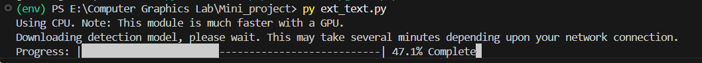
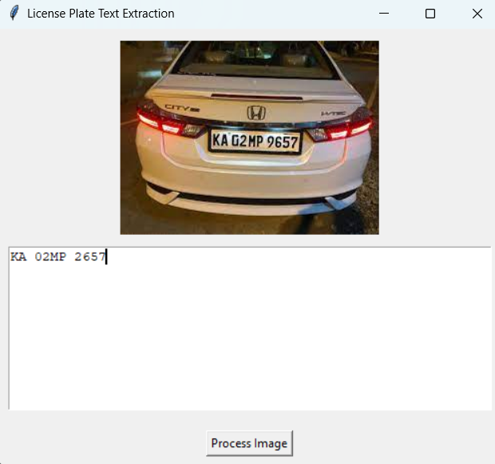
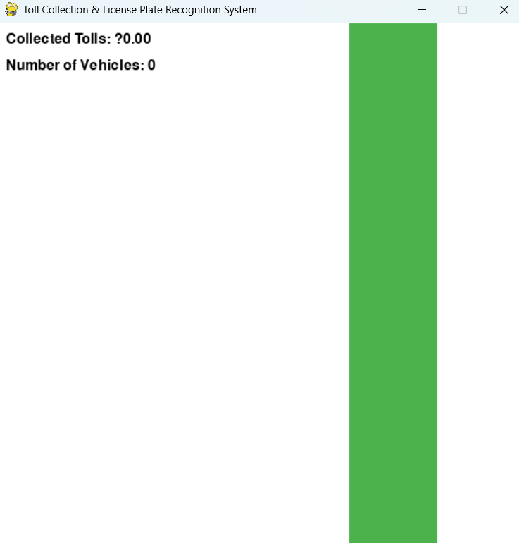
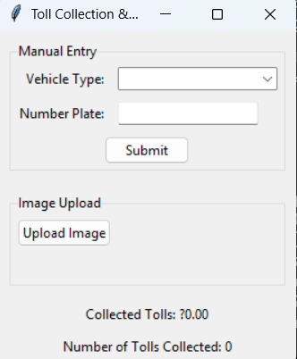
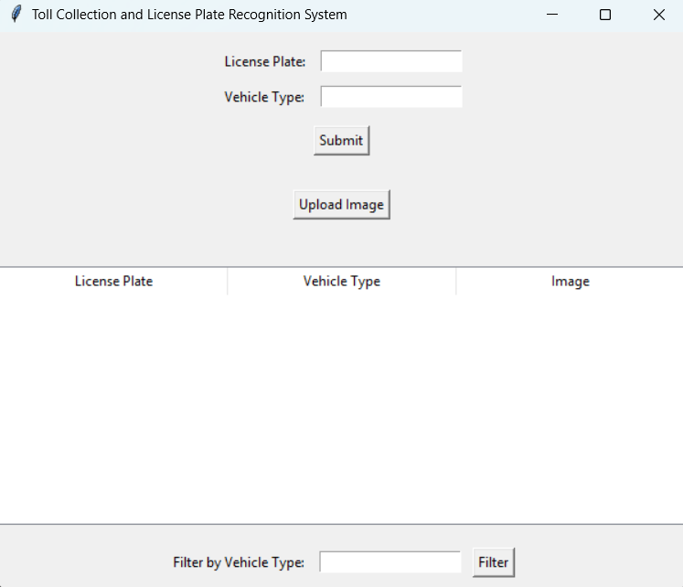
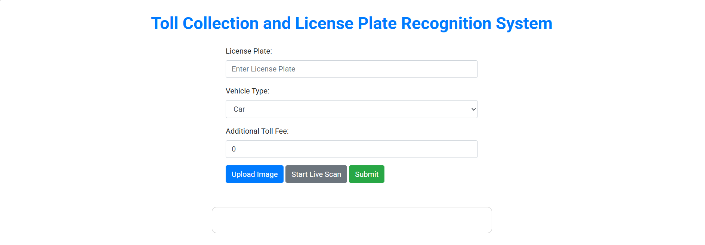
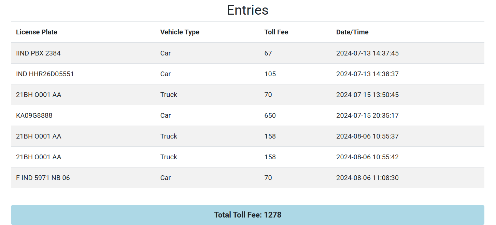
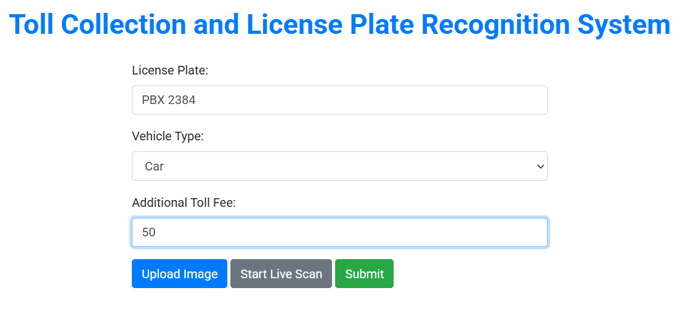

# License_Plate_detection_and_toll_collection
License_Plate_detection_and_toll_collection is a Python-based computer vision project that automatically detects vehicle license plates from real-time images or video streams and extracts the plate number using Optical Character Recognition (OCR). It simulates an automated toll collection system by identifying registered vehicles.

## Version 1.0: License Plate Text Extraction with GUI
Version 1 introduces a simple **Python-based GUI application** for extracting text from license plates using `EasyOCR` and `OpenCV`. It processes images offline and displays the results in a Tkinter interface.

### Added: extract_img.py
- A utility script that extracts text from a given license plate image.  
- Uses EasyOCR to detect text and visualize results with OpenCV and Matplotlib.  
- Part of the core functionality for testing OCR separately from the GUI.
#### Requirements 
``` bash
 pip install opencv-python pytesseract pygame numpy easyocr matplotlib numpy pillow
```
### 📷 Snapshots

**Model Download Initialization**  
Image showing the downloading of the text detection model required by EasyOCR.  


**Version 0.1 - Early Output Example**  
Initial version showing detection errors and limited accuracy (~72%).  



---
## Version 1.1: Project Refinement and User Experience (UX) Enhancement

This version is focused on improving the user experience by testing and implementing various user-centric features. The objective is to refine the interface and functionality based on user requirements. This includes making the application more intuitive and responsive, streamlining workflows, and gathering feedback to guide future development. The primary goal is to enhance the overall usability and make the tool more practical for real-world scenarios.

### **Snapshots**

**Initial UI Concept**
An early prototype of the user interface, demonstrating the layout and design direction for improved user interaction.


---

## Version 1.3: Manual Data Entry and Correction

A significant feature in this release is the addition of a manual data entry option. Users can now input a license plate number directly using a keyboard or other input devices. A new correction feature allows for editing any minor discrepancies in the scanned text, ensuring data accuracy. This addresses potential OCR errors, providing a robust mechanism for maintaining data integrity. This version also includes a validation process to verify the format of the entered license plate numbers.

### **Snapshots**

**Manual Data Entry Screen**
The new user interface screen where users can manually input or edit a license plate number.


---

## Version 1.4: Enhanced Data Management and Search

This version expands the data fields to capture more detailed information about vehicles and their owners. It also introduces an integrated search function to streamline data retrieval. Users can now filter and find specific records quickly using various criteria. Currently, data is stored in a temporary cache for immediate use, with future plans to transition to a more persistent storage solution, such as a local file system or a relational database, to ensure long-term data retention and scalability.

### **Snapshots**

**Data Table with Search Functionality**
A view of the enhanced data table, showcasing the added columns and the new search bar for efficient data filtering.


---

## Version 1.5: Transition to Web-Based Application

In this major architectural shift, the project transitions from a desktop GUI to a web-based application. This change provides greater accessibility and flexibility across a variety of platforms and devices, allowing users to access the system from any browser. The new web interface is designed to be responsive, ensuring a consistent user experience on desktops, tablets, and mobile devices. The current objective is to integrate local data storage capabilities within this new web framework, paving the way for a more distributed and scalable system.

### **Snapshots**

**Web App Landing Page**
The new landing page of the web application, designed for cross-platform access.


**Real-time License Plate Detection**
A snapshot of the web application performing real-time license plate detection from a video stream.


**Data Entry Form on Web**
The web-based form for manual data entry, optimized for various screen sizes.

